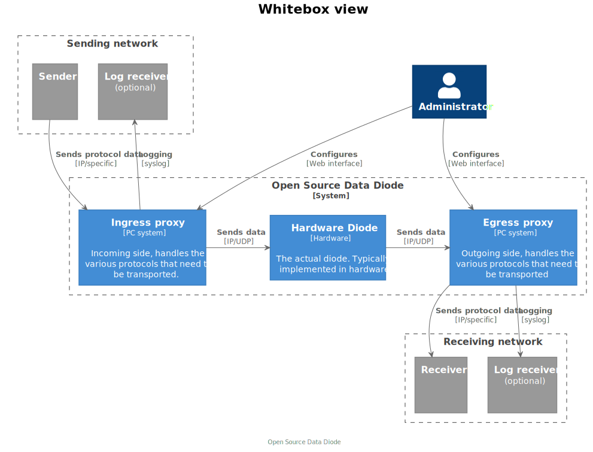
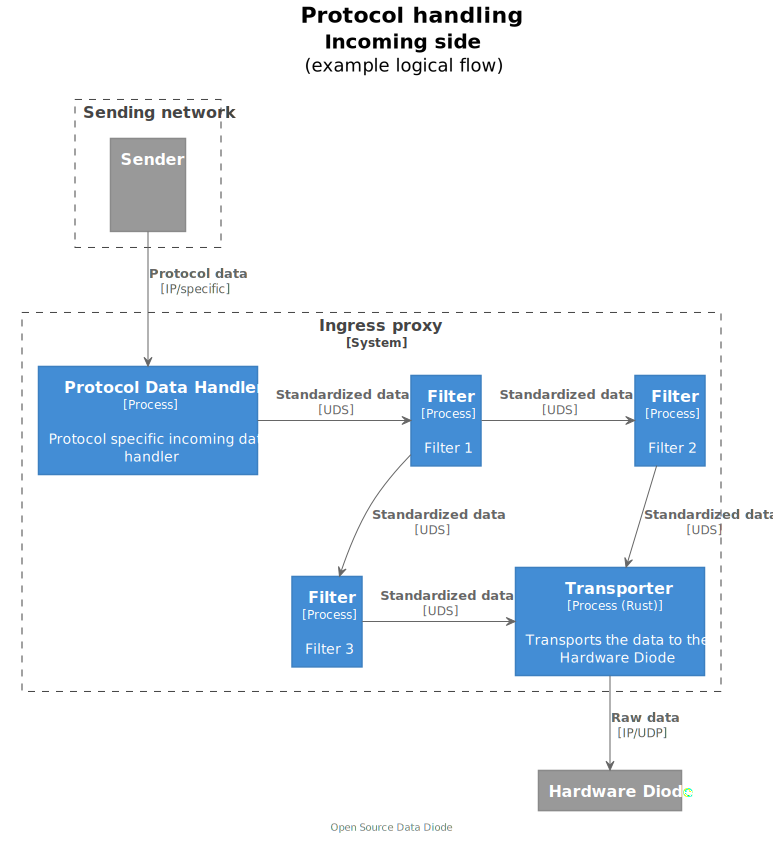

Intro
-----
This is the design document for the Open Source Data Diode (OSDD). This document describes the major design decisions for this prototype. 

 
# General overview 
 

The open source data diode consists of three main parts: 
1.	The ingress proxy 
2.	The hardware diode 
3.	The egress proxy 

The ingress proxy is responsible for turning any bidirectional communication protocol into a unidirectional communication protocol.

The egress proxy is responsible for turning the incoming unidirectional data stream into the corresponding bidirectional data stream. 

The hardware diode is positioned as very smart network cable. One that only allows Ethernet frames to go in one single direction. 

 
# The insides of a proxy

 
The proxies turn application protocols into a OSDD specific line protocol and back. When needed with filters in between. 

## Software components
The following software components can be identified:
* Every proxy needs one software component for each application protocol supported. That is, one sending and one receiving component per application protocol. 
* A software component is needed for each type of filter. 
* Both sides need one sending and one receiving component for transporting the data through the diode using its specific line protocol. 
* A software component that starts and monitors all components above.

## Kafka software components
To support Kafka as an application protocol and have the ability to filter Kafka data based on its contents, we need the following components, in order, from sending side to receiving side:
* A Kafka consumer that reads data from a Kafka server
* A filter
* A UDP sender
* A UDP receiver
* A Kafka producer that sends data to a Kafka server 

# OSDD Process model
Earlier several software components were identified that form an ingress or egress proxy. The next question to answer is how to run these components. Do they run on different machines? Do they run in separate processes or as threads in a single process?

There are three major choices that influence the answer to these questions:
1.	The wish to deploy the OSDD on low-level hardware on a single machine
2.	The wish to expand the protocol capabilities of the OSDD
3.	The wish to run the components in a containerized environment 

The first is the wish to be able to deploy the OSDD on low-level hardware which means it needs the ability to run on a single machine. 

The second is the expandability of the system. Especially growing the number of protocol handlers. Creating a protocol handler efficiently largely depends on the availability of a good library implementing a specific protocol. To increase the chances of being able to use any available library in a protocol handler, we need to allow for creating protocol handlers in any programming language. 

This choice rules out running the OSDD components as threads in a single process.

For increased security and easy of deployment we want to run all components in a containerized environment. 

After all this we end up with the following model:

**An OSDD proxy runs one OSDD management process (a Unix Service Daemon), that in turn
starts a Docker container for each traffic handling component.**

An added benefit of running on a single machine (per side) is the reduced communication overhead and latency between the components.
 
# Communication between the proxies

## Communication layer

The two proxies need to communicate without the need for bi-directional communications. We chose to use UDP as the transportation layer for the following reasons:
* It is uni-directional so it actually gets across the hardware diode
* It can be used from user space. Writing Ethernet frames directly requires ‘root’ access on a Linux system. This is a bad security practice.
* It is packet based which makes it easy to see the begin and end of transmissions.

## Protocol
In order to achieve maximum bandwidth we chose to create a minimal protocol that only adds a few extra header fields and can directly carry any sequence of bytes as payload.

Our header currently looks like this:
* 1 byte: message type (START, DATAFIRST, DATA, HEARTBEAT, SHUTDOWN)
* 4 bytes: sequence number
* 2 bytes: payload length
* 2 bytes: remaining data messages

This is a 9 byte header. All the other bytes in a UDP packet (65507-9) can be used for payload.

## Communication between components in the proxy

All components in a proxy communicate using Unix Domain Sockets. They are a low overhead option that cannot accidentally be configured to accept data from, or send data to, an outside party. 
Throttling & backpressure
The sending side cannot receive feedback whether it is sending too fast or not. That is the whole idea of a diode. In the situation that the receiving side cannot handle the incoming data fast enough, the only option you have is to throttle the sending side. 

In the OSDD the transport handler is responsible for throttling throughput. But this component is not the only one in the chain. 

Let’s consider a situation where a Kafka chain is configured and the Kafka handler is able to read faster from the Kafka server than the transport handler is able (because of configuration) to send through the diode. 

In the case of Kafka the choice is simple, Kafka already has storage, so a backpressure mechanism lets the Kafka handler know that it should not read from Kafka until the pressure goes away.

Technically, this works by leveraging the blocking nature of the communication layer between the components. The transport handler will not read data from the incoming Unix Domain Socket when its transmit buffers (on the UDP side) are full. The Kafka handler will not read data from Kafka when its send buffers (on the Unix Domain Socket side) are full.  

# Logging & Metrics
To monitor the health and performance of the OSDD access to its logging and metrics is needed. The question is: where will the data be stored and how can it be accessed?

There is no one single answer that satifies all future needs. It varies according to the deployment location and the facilities and needs of the operator. 

Therefore the OSDD will provide mechanisms for all components to create logging and metrics and do this in a way that the where and how can be determined by the operator.

## Logging
For logging such a mechanism exists in the Unix Syslog interface. All components send their logging data out in UDP packets according to the Syslog standard. The OSDD framework will provide a mechanism to catch these packets and re-route them to a configurable destination. 

## Metrics
For metrics such a mechanism exists in the statsd standard. All components send their metrics in the form of statsd UDP packets. The OSDD framework will provide a mechanism to catch and re-route them to a configurable location.

In order to understand the metrics coming out of all the OSDD components, a standard naming scheme has been designed:

**`osdd.<instance>.<direction>.<type>.<chain>.<metric>`**

Element	| Options
--------| ---------
Instance | A specific instance of the OSDD, configurable by customer
Direction | Either ingress or egress
Type | Either ph, filter of transport
Chain | Name of the configured data chain
Metric	| One of: in_bytes, out_bytes, in_packets, out_packets, dropped_bytes, dropped_packets

## Metrics through the diode
The OSDD currently has a special protocol handler that can transport statsd protocol through the diode. This can be configured.
Consuming logging & metrics
How to consume this data is up to the party that deploys an OSDD. Metrics can be sent to metrics servers like Prometheus and Graphite. Logging can be send to any Unix Syslog server or systems like Logstash. Great visualisations can be created with tools like Grafana.
 
# Configuration
The proxies can be configured using a configuration file (per side) in the TOML format. A TOML format file is easily readable by both humans and software.

The configuration file has the following structure:

Tag | Explanation
----|------------
`[settings]` | One section, general settings for the OSDD
`[chain.<NAME>]` | Multiple sections, configure a chain, select the protocol handler, filters (zero or more) and a transport layer. This selections refers to the name of the component configured in the following sections.
`[protocol_handler.<NAME>]` | Multiple sections, configure a protocol handler to be used in a chain.
`[filter_handler.<NAME>]` | Multiple sections, configure a filter to be used in a chain
`[transport_handler.<NAME>]` | Multiple sections, configure a transport to be used in a chain.

 A separate document describes the configuration in more detail.
